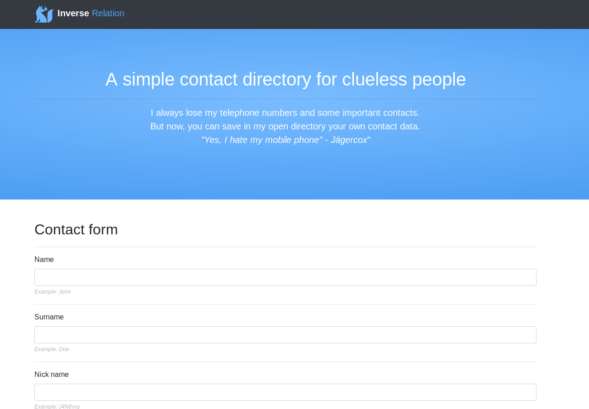
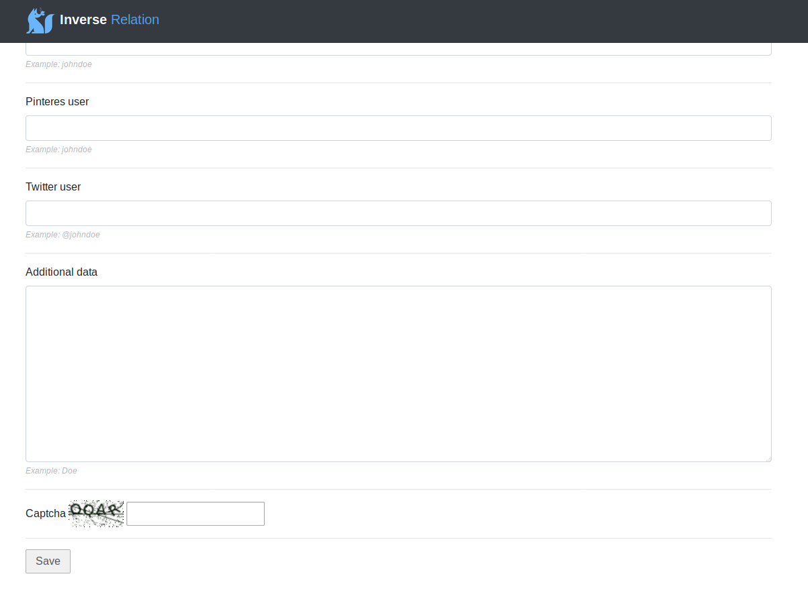

# Inverse Relation

## Install and run Inverse Relation

Install "Inverse Relation" contact form.

```
./install.sh
```

First time and test.

```
./clean-run.sh
```

Use run.sh normally. Use it with supervisor on your server.

```
./run.sh
```

Finally, try it...

```
http://127.0.0.1:8000/
```

## Screenshots

Screenshot 1



Screenshot 2
